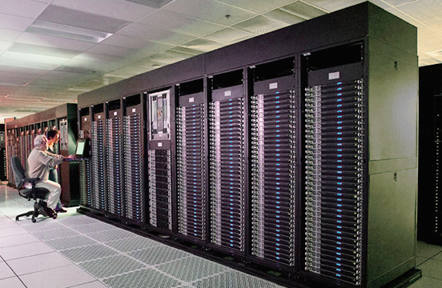

*****
ATLAS
*****

Getting started
###############

Log into the system
*******************

1. Log in to the access node ac.sw.ehu.es:

.. code-block:: bash
	  
   ssh username@atlas.sw.ehu

You can also establish connection with login nodes manually:

.. code-block:: bash

   ssh username@ac-01.sw.ehu.eus
   ssh username@ac-02.sw.ehu.eus
   
2. Establish connection with atlas.sw.ehu.es:

.. code-block:: bash

   ssh username@atlas.sw.ehu.eus
 
You would need to bring your files and data over, compile your code or use the compiled one, and create a batch submission script. Then submit that script so that your application runs on the compute nodes. Pay attention to the various file systems available and the choices in programming environments.

SSH key generation
==================

Technical details
*****************

	   

.. list-table:: Atlas Specifications
   :widths: 25 100
   :header-rows: 0

   * - **Operating System**
     - GNU/Linux CentOS 7.2
   * - **Resource manager**
     - Torque 4.2.10
   * - **Scheduler**
     - Maui 3.3.1       
   * - **Purchase year**
     - 2015, 2016, 2017
   * - **Nodes**
     - 17 nodes with 2 12-core Intel Xeon E5-2680 v3 at 2.50GHz and 500GB of RAM. Labeled as *bigsize*.
       
       33 nodes equipped with 2 12-core Intel Xeon E5-2680 v3 at 2.50GHz (24 in total) and 245GB of usable RAM each. Labeled as *mediumsize*.
       
       66 nodes equipped with 2 12-core Intel Xeon E5-2683 v4 at 2.10GHz (32 in total) and 245GB of usable RAM each. Labeled as *mediumsize*.
       
       56 nodes equipped with 2 12-core Intel Xeon E5-2680 v3 at 2.50GHz (24 in total) and 120GB of usable RAM each. 
   * - **Network**
     - 56 Gbps FDR Infiniband and an additional 1Gbps Ethernet network for management. It consist of a ring topology over 5 switches.
   * - **File storage and I/O**
     -  80 TB of global scratch storage area is supported by a BeeGFS parallel distributed file system with 6 I/O servers.

Running jobs on Atlas
#####################

Batch jobs are jobs that run non-interactively under the control of a *batch script*, which is a text file containing a number of job directives and GNU/linux commands or utilities. Batch scripts are submitted to the batch system, where they are queued awaiting free resources. The batch system has two components on Atlas:

- Torque as the resource manager is in charge of:

  1. Accepting and starting jobs/tasks across a batch farm (qsub).
  2. Cancelling jobs (qdel).
  3. Monitoring jobs (qstat).
  4. Accounting.

- Maui as the scheduler is in charge of scheduling the jobs.

Submitting your jobs
********************

1. First you will need to bring all your data over. This includes all your input files and programs. Since no direct access to cluster's master/access node is allowed you an do this in two ways:

a) *sft/scp* your files to your home directory mounted on any of the *ac* computers. For example, while you are in your computer:

      
.. code-block:: bash

   scp my_stuff username@ac.sw.ehu.eus:

      
b) *sftp/scp* your files while you are connected to the master node:

      
.. code-block:: bash
		
   scp username@mycomputer:<my_stuff> /scratch/username/my_dir

2. Jobs can only be submitted from the */scratch* filesystem. Therefore, before submitting any jobs you will need to move or copy
   all your files to a subdirectory under your */scratch* directory (which typically would be */scratch/username*).
3. Prepare your batch script and submit is using the *qsub* command:

.. code-block:: bash
		
   qsub batch_script.pbs

Queues
******

.. list-table:: Queues
   :widths: 25 100
   :header-rows: 1

   * - **Queue**
     - **Description**
   * - General purpose routing queue.
     - Queue for users that belong to *qchem* group.
   

Monitoring and managing jobs
****************************

Batch script examples for pure MPI applications
***********************************************

.. code-block:: bash
   
   #!/bin/bash                                                          
   #PBS -q parallel
   #PBS -l nodes=1:ppn=24:mediumsize
   #PBS -l mem=192gb
   #PBS -l cput=1000:00:00 
   #PBS -N JOB_NAME                                                                                                                         
 
   export LSCRATCH_DIR=/lscratch/$USER/jobs/$PBS_JOBID
   mkdir -p $LSCRATCH_DIR
   cd $PBS_O_WORKDIR
   cp -r * $LSCRATCH_DIR
   cd $LSCRATCH_DIR
 
   module load program/version
 
   export NPROCS=`wc -l < $PBS_NODEFILE`
 
   mpirun -np $NPROCS program >& OUTPUT_FILE 
 
   export RESULTS_DIR=$PBS_O_WORKDIR/RESULTS
   mkdir -p $RESULTS_DIR
   cp -r * $RESULTS_DIR
   rm -rf $LSCRATCH_DIR

.. code-block:: bash
   
   #!/bin/bash                                                          
   #PBS -q parallel
   #PBS -l nodes=1:ppn=24:bigsize
   #PBS -l mem=500gb
   #PBS -l cput=1000:00:00 
   #PBS -N JOB_NAME                                                                                                                         
 
   cd $PBS_O_WORKDIR
  
   module load program/version
 
   export NPROCS=`wc -l < $PBS_NODEFILE`
 
   mpirun -np $NPROCS program >& OUTPUT_FILE 
 
   
Batch script examples for pure OpenMP applications
**************************************************

.. code-block:: bash
   
   #!/bin/bash                                                          
   #PBS -q parallel
   #PBS -l nodes=1:ppn=24:smallsize
   #PBS -l mem=100gb
   #PBS -l cput=1000:00:00 
   #PBS -N JOB_NAME                                                                                                                         
 
   cd $PBS_O_WORKDIR

   module load program/version
 
   export NPROCS=`wc -l < $PBS_NODEFILE`
 
   export OMP_NUM_THREADS=24

   my_openmp_program >$ OUTPUT_FILE
   

Batch script examples for hybrid parallel applications
******************************************************

File storage and I/O
####################

.. list-table:: Filesystems
   :widths: 25 25 25 25 25 25 50
   :header-rows: 1

   * - **Description**
     - **Mount point**
     - **Quota**
     - **Size**
     - **Purpose**
     - **Backup**
     - **Purge Cycle**
   * - `Home directory  <http://www.python.org/>`_
     - /dipc
     - 600 GB
     - 44 TB
     - Storage, compilation
     - Yes, daily
     - Never purged
   * - `Scratch filesystem  <http://www.python.org/>`_
     - /scratch
     - 1.5 TB
     - 88 TB
     - running jobs
     - No
     - Purged every month (not implemented yet)
   * - `Lscratch filesystems  <http://www.python.org/>`_
     - /lscratch 
     - None 
     - 400 GB
     - running single node jobs
     - No
     - Purged every month (not implemented yet)

Software
########

For a more detailed explanation about how to use installed software on Atlas, please refer to `Environment Modules <http://www.google.es>`_ section.

Compiling your code
*******************

Intel compilers are recommended for building your applications on Atlas. There is no system default modulefile that takes care of this. Use the *module avail* command to see what versions are available and load an Intel compiler module before compiling. For example:

.. code-block:: bash

   module load intel/2017b

Notice that when a compiler module is loaded, some environment variables are set or modified to add the paths to certain commands, include files, or libraries, to your environment. This helps to simplify the way you do your work.

As an alternative, Atlas also offers a collection of open source tools such as compilers or scientific libraries. Use *module avail* command to see versions available. For example:

.. code-block:: bash

   module load foss/2017b
   module load FFTW/3.3.6-foss

Profiling and debugging tools
*****************************

Limits
######

Soft limits are those that could be surpassed when the load of the cluster is low whereas hard limits those specified by the hardware of the cluster. 

.. list-table:: Atlas Limits
   :widths: 25 25
   :header-rows: 0

   * - **Soft limits**
     - Maximum number of processors per user: 144
   * - **Hard limits**
     - Maximum number of processors per user: 4114
